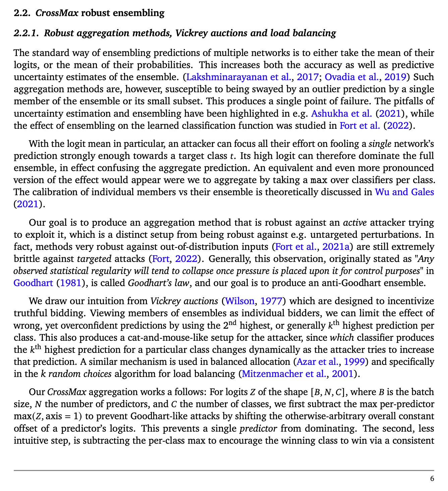
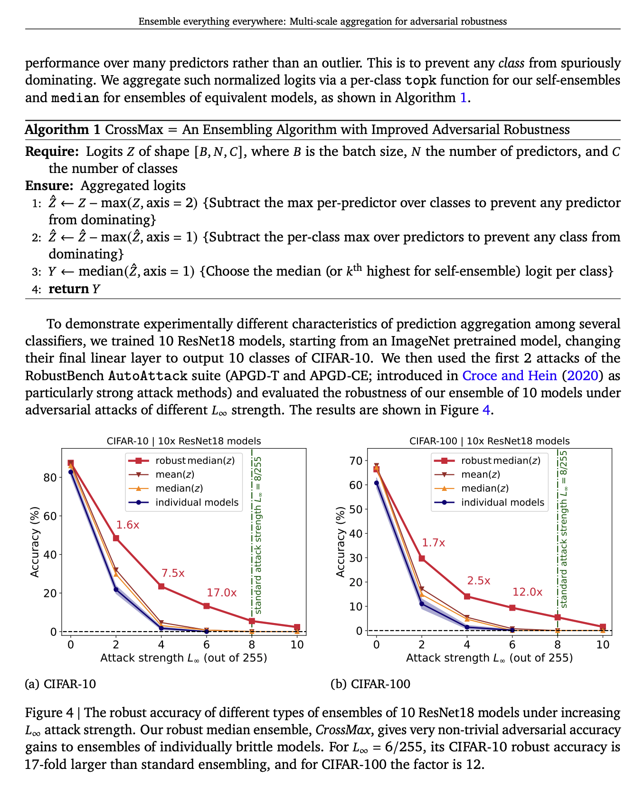

# Evaluate-CrossMax-Ensemble

This code evaluates the robust accuracy of the `CrossMax Ensemble` defense technique proposed by [Fort et al. (2024)](https://arxiv.org/pdf/2408.05446).

We evaluate the new technique using a transfer attack from a standard ensemble. This reduces the
robust accuracy of the CrossMax Ensemble from ~77% to ~2%.


`python evaluate_defense.py`

```
Training 10 models for use in standard and robust ensemblees...
100%|█████████████████████████| 10/10 [00:47<00:00,  4.71s/it]
Generating first batch of adversarial examples using PGD against the robust ensemble...
100%|███████████████████████| 100/100 [00:04<00:00, 20.28it/s]
Accuracy on first batch of adversarial examples:
CrossMax ensemble: tensor(0.7780)
Standard ensemble: tensor(0.7840)
Generating second batch of adversarial examples using PGD against the standard ensemble...
100%|███████████████████████| 100/100 [00:04<00:00, 21.48it/s]
Accuracy on second batch of adversarial examples:
CrossMax ensemble: tensor(0.0220)
Standard ensemble: tensor(0.0240)
```





